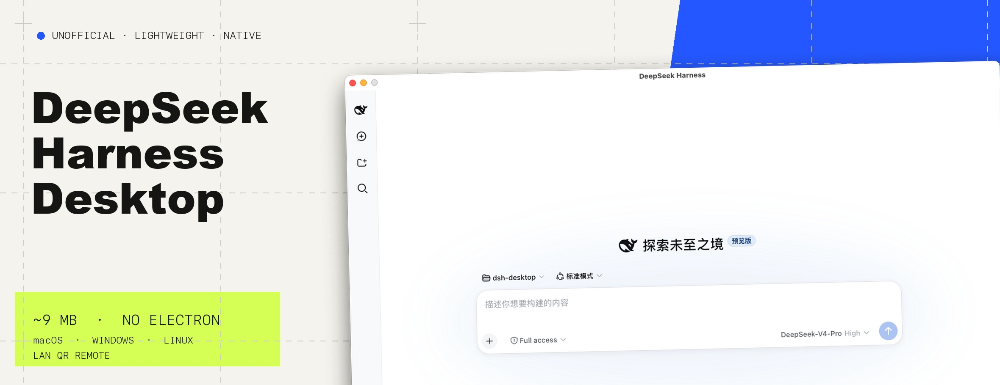
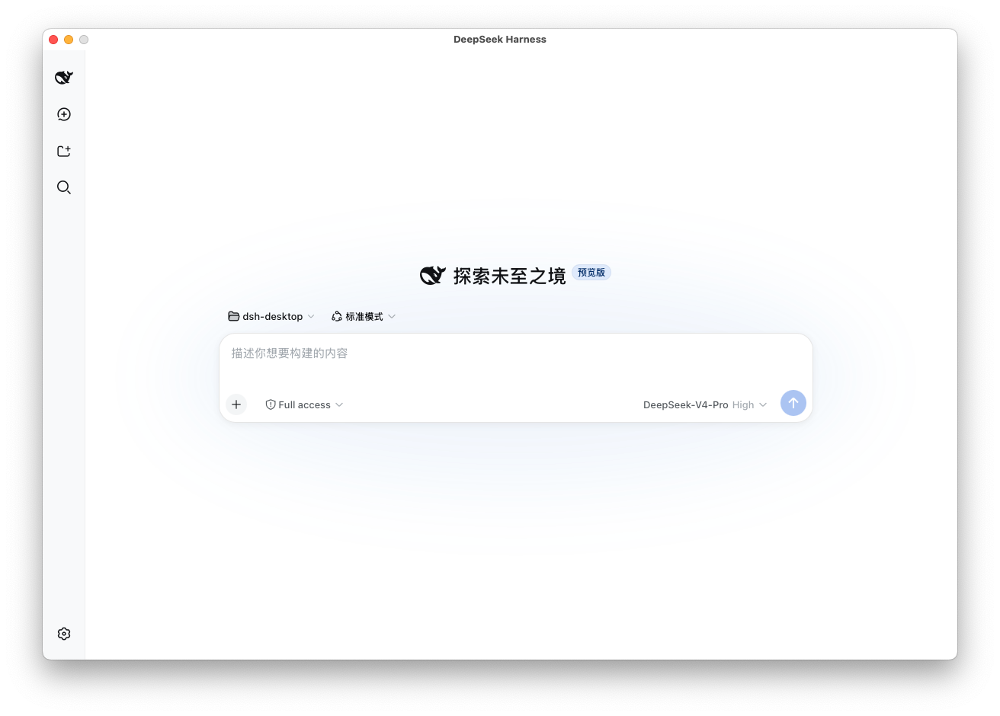
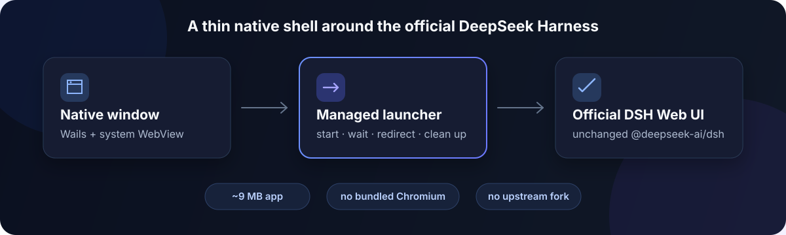
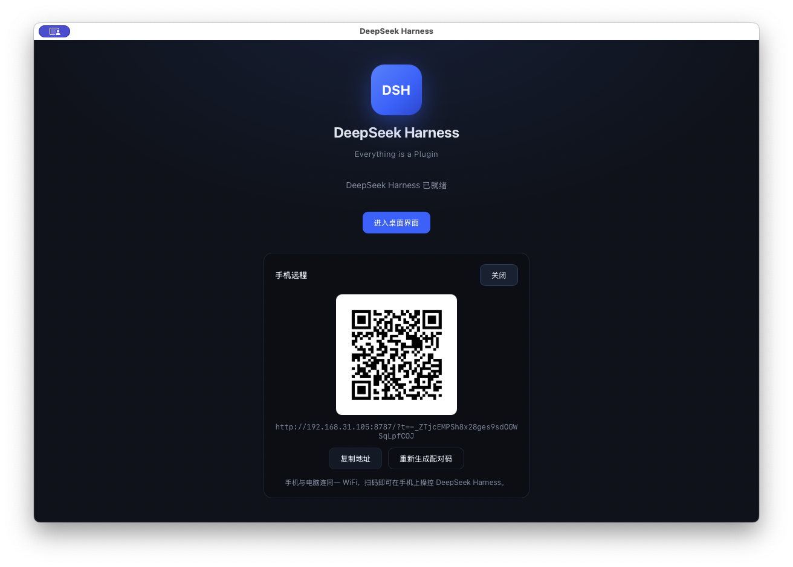

<p align="center">
  
</p>

# DeepSeek Harness Desktop

> An **Electron-free** desktop shell for [DeepSeek Harness](https://github.com/deepseek-ai/deepseek-harness): a native, Codex-style desktop app built with [Wails](https://wails.io) (Go) + the system's native WebView, wrapping the official `@deepseek-ai/dsh` Web UI.

**The same functionality, an order of magnitude smaller.** ~9MB on disk, no bundled Chromium, no upstream fork, no vaporware.

> ⚠️ This is a community project with no affiliation with DeepSeek / DeepSeek AI. DeepSeek Harness itself is still in developer preview (v0.1) and its interfaces may change at any time.

<p align="center">
  
</p>

## Why this one

Most DeepSeek Harness desktop shells are built on **Electron**. This project takes a different path:

| | Typical Electron shell | This project |
|---|---|---|
| Stack | Electron (bundles Chromium + Node) | Wails (Go) + system native WebView |
| App size | ~100MB+ | **~9MB** |
| Runtime | Carries a full Chromium baseline of memory/processes | Reuses the system WebView (macOS `WKWebView` / Windows `WebView2`) |
| Upstream | Forks source + patches + pins a submodule | **Runs the official npm package**; upgrade = one version string |
| Roadmap | Homepage full of "coming soon" | Only promises what works after install |

## How it works

- On launch, uses `npm exec` to bootstrap `pnpm@11.7.0`, then starts `@deepseek-ai/dsh@0.1.0-rc.8 web --no-open` on a managed port (prefers `3080`, falls back to a random port if taken)
- Polls the local Web UI until ready, then redirects the window to that address
- Cleans up the entire process tree on exit (npm → pnpm → node → dsh); if the service exits unexpectedly, shows a native dialog and quits

All sessions, models, plugins, and settings are provided by upstream DeepSeek Harness — this project does not modify or re-implement its UI.



## Features

- Native window / Dock icon / app menu
- Launch splash: status, retry, open in browser, view logs
- LAN phone remote: scan a QR code on the same Wi-Fi to control the current DeepSeek Harness from a mobile browser
- Auto-installs and pins the DeepSeek Harness version
- Logs to `~/.dsh-desktop/logs/dsh.log`

## Phone remote (LAN)

Connect the computer and phone to the same trusted Wi-Fi, click **Enable** in the launch panel, and scan the QR code to open the current DeepSeek Harness on the phone. No account or cloud relay is required; tasks, sessions, and files remain on the computer.

<p align="center">
  
</p>

- Pairs a Device through a QR code containing a one-time code, then stores a Device credential in an HttpOnly cookie
- Regenerating the pairing code only replaces an unused code; revoke an already paired Device from the Device list
- Disabling phone remote stops the LAN proxy and clears the pending pairing code while retaining paired Device records

> The current release uses self-signed HTTPS on a **trusted LAN** and displays the certificate fingerprint for verification. It is not public-internet remote access; do not expose it directly to the internet.

## Download / Install

Get the installer for your platform from [Releases](https://github.com/zsyu9779/dsh-desktop/releases):

- **macOS**: `dsh-desktop-darwin-universal.dmg` (universal, Intel + Apple Silicon)
- **Windows**: `dsh-desktop.exe` (portable, amd64)
- **Linux**: `dsh-desktop-linux-amd64.tar.gz`

> macOS Gatekeeper will block an unsigned app on first launch: right-click the app and choose "Open" to allow it, or run
> `xattr -d com.apple.quarantine "/Applications/dsh-desktop.app"`.

## Requirements

- Go 1.23+
- Node.js 22.19+ on the 22.x line, or Node.js 24+
- Wails v2: `go install github.com/wailsapp/wails/v2/cmd/wails@latest`

## Build

```bash
wails build
# output at build/bin/dsh-desktop.app
```

## Develop

```bash
wails dev
```

## Release

Push a `v*` tag to trigger GitHub Actions to build and publish macOS / Windows / Linux installers to Releases:

```bash
git tag v0.1.6
git push origin v0.1.6
```

## Configuration (environment variables)

| Variable | Purpose |
| --- | --- |
| `DSH_COMMAND` | Override the launch command, e.g. `DSH_COMMAND="pnpm dsh"` or a local source path |
| `DSH_WORKSPACE` | dsh working directory (defaults to the home directory) |
| `DSH_HOME` | Passed through to dsh; controls where profiles are stored |

## Updating the DeepSeek Harness version

Edit the `dshPackage` constant in `dsh.go`.

## Clear boundaries

- **Not** an official DeepSeek product, and doesn't pretend to be.
- **Not** a fork or patched DeepSeek Harness — it runs the official npm package and follows upstream releases.
- Phone remote currently supports trusted-LAN access only; there is no public relay, account sync, or push notification service.
- **No** "coming soon" feature list. Everything written in this README works right after install.

## License

[MIT](./LICENSE). DeepSeek Harness itself is MIT licensed.
